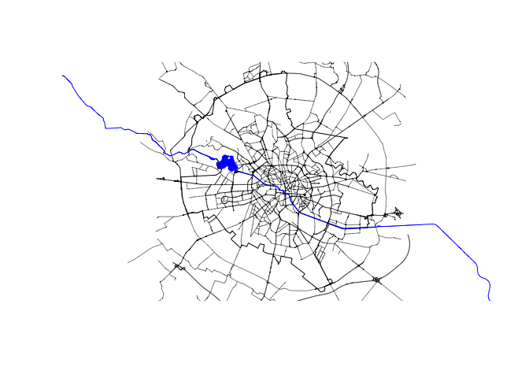

<!-- README.md is generated from README.Rmd. Please edit that file -->

# CRiSpData

<!-- badges: start -->

[](https://github.com/CityRiverSpaces/CRiSpData/actions/workflows/R-CMD-check.yaml)
<!-- badges: end -->

This package contains geospatial data on urban river spaces used in
[CRiSp](https://github.com/CityRiverSpaces/CRiSp) and related packages.
The dataset contains vector data of the city boundary, bounding box
enclosing the city boundary, spatial networks (street centerlines,
railway lines), the river (centerline and surface), buildings
surrounding the river, as well as a digital elevation model.

The current dataset contains the case of River Dâmbovița in Bucharest.
The data were derived from open sources such as
[OpenStreetMap](https://wiki.openstreetmap.org/wiki/Overpass_API) and
[Copernicus DEM
GLO-30](https://dataspace.copernicus.eu/explore-data/data-collections/copernicus-contributing-missions/collections-description/COP-DEM).

## Installation

You can install the released version of CRiSpData from
[CRAN](https://cran.r-project.org) with:

``` r
install.packages("CRiSpData")
```

You can install the development version of CRiSpData from
[GitHub](https://github.com/) with:

``` r
# install.packages("pak")
pak::pak("CityRiverSpaces/CRiSpData")
```

## Example

``` r
library(CRiSpData)
library(sf)

plot(bucharest_osm$boundary)
plot(bucharest_osm$streets$geometry, lwd = 0.5, add = TRUE)
plot(bucharest_osm$river_centerline, col = "blue", add = TRUE)
plot(bucharest_osm$river_surface, col = "blue", border = NA, add = TRUE)
```



## Attribution

This package includes or derives data from the following sources:

- **Copernicus GLO-30 DEM**  
  Some datasets are based on data provided by the European Space Agency
  (ESA).  
  Usage is governed by the [ESA User
  License](https://dataspace.copernicus.eu/sites/default/files/media/files/2025-01/cscda_esa_user_licence_10.01.2025.pdf).

- **OpenStreetMap (OSM)**  
  This package uses data from
  [OpenStreetMap](https://www.openstreetmap.org), © OpenStreetMap
  contributors.  
  The data is licensed under the [Open Database License (ODbL)
  v1.0](https://opendatacommons.org/licenses/odbl/1-0/).  
  If you publicly use any adapted data from this package, you must also
  offer it under the ODbL.

Please ensure you comply with the attribution and license requirements
when using or redistributing this package.
